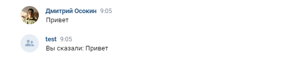

# Бот VK 

## Описание 
Данный бот для VK специализируется на ответах на сообщения в сообществе, дублируя полученный текст пользователя.



Бот разработан с использованием Spring Boot и применяет Callback API для получения уведомлений о событиях в сообществе.

## Настройка бота 

Для начала работы с ботом нужно настроить сервер в сообществе VK:

### Настройка сообщества
Прежде, чем начать работу с ботом необходимо настроить  сервер во вкладке "Работа с API" по ссылке https://vk.com/link_to_your_group?act=api
1. Укажите версию API: 5.199.
2. Укажите HTTPS-адрес, полученный с помощью ngrok.
3. Подтвердите адрес сервера, добавив `group_id` и строку подтверждения в `local.properties`.
4. Укажите секретный ключ, затем также добавьте его в файл `local.properties`.
5. Перейдите во вкладку "Типы событий" и выберите тип "Входящее сообщение", чтобы бот смог получить callback при появлении сообщения от пользователя.
6. Перейдите во вкладку "Настройки для бота" (https://vk.com/link_to_your_group?act=messages&tab=bots) и активируйте возможности для ботов.

### Установка приложения
Для локального развертывания используем ngrok. Приложение Spring Boot будет работать на http://localhost:8080.

1. Клонирование репозитория
``` bash
git clone https://github.com/osokindm/justVkBot
```
2. Запуск ngrok 
```bash
ngrok http http://localhost:8080
```
3. Настройка конфигураций

Добавьте следующие параметы в [local.properties](src/main/resources/local.properties):

- `vk.confirmation_key` - строка, которую должен вернуть сервер
- `vk.secret_key` - cекретный ключ
- `vk.access_key` - ключ доступа
- `vk.group_id` - id сообщества
4. Запуск приложения
``` bash
gradlew bootRun
```